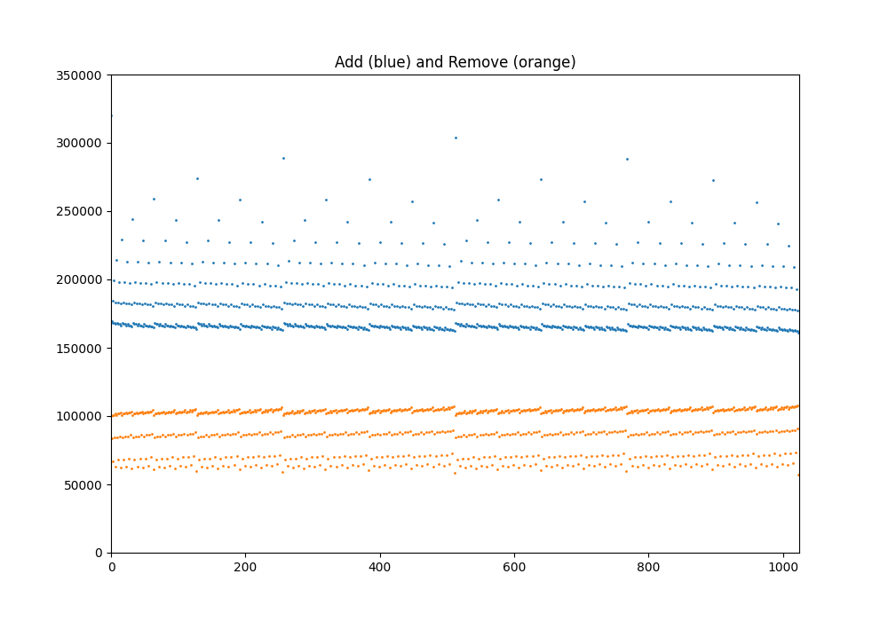

# Sparse merkle tree in solidity

Optimised sparse merkle tree writen in solidity.

Key features:
- Size adjustments (function `increaseDepth` and `decreaseDepth`)
- Update elemnts - `O(log N)`

## Instalation

Brownie

```
python3 -m venv env
source env/bin/activate
pip install -r requirements.txt
```

Ganache

```
nvm install 14
nvm use @14
npm install ganache-cli
```

## Compile

```
brownie compile
```

## Run test

Run in different terminals

```
ganache-cli
```

And run test

```
brownie test
```

## Gas usage

```
brownie run spt
```

Result (depth = `10`)

```
ADD
Median: 
176379
Average: 
179905.3046875
Min: 
160493
Max: 
319329

Remove
Median: 
99561
Average: 
90149.416015625
Min: 
57457
Max: 
107658
```

Generate nice image:

```
python diagram.py
```

{width="2000px"}